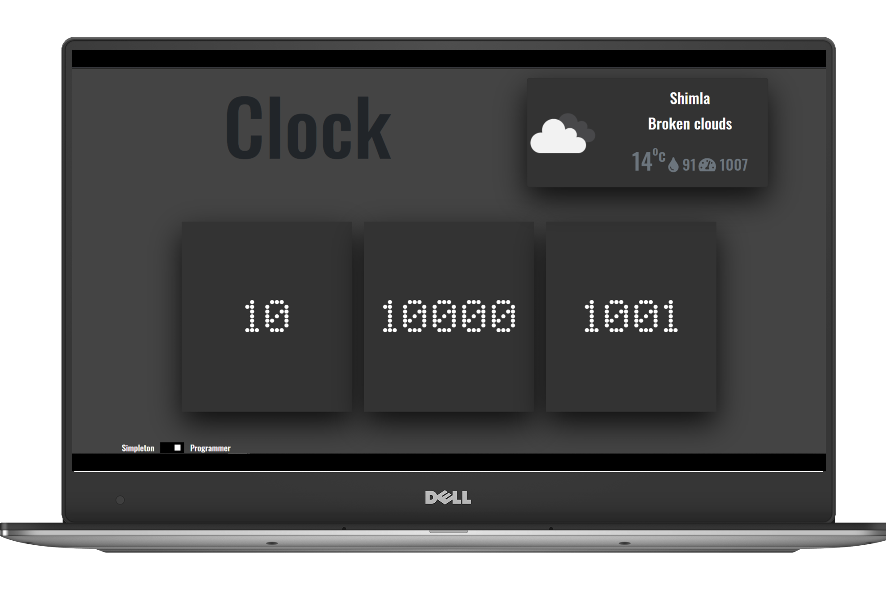

# Programmer-Clock

Programmer Clock is a clock with weather forecast. The most unused clock. 
<b>A Clock That No One Asked For.</b>
  

  

## Technology Used:

- HTML
- CSS
- JavaScript
- Bootstrap
- Weather API

### Project Link

[A Programmer Clock](https://yogeshk4124.github.io/Programmer-Clock/)

## 👍 Contribution

1. Fork it
2. Create your feature branch (git checkout -b my-new-feature)
3. Commit your changes (git commit -m 'Add some feature')
4. Push to the branch (git push origin my-new-feature)
5. Create new Pull Request

### Show some :heart: and :star: the repository to support the project

For more contact me @[Gmail](mailto::yogeshk4124@gmail.com),

### Facing Any Problem or need any Help:grey_question:

Incase you need any problem or need any help write me in [issues](https://github.com/Yogeshk4124/A-Programmer-Clock/issues) section.
